# 🛒 Sistem Kasir - Toko Makanan

Sistem kasir modern dengan fitur lengkap untuk toko retail/makanan. Dibangun dengan React + Vite (Frontend) dan Python FastAPI (Backend).


## ✨ Fitur Utama

| Fitur | Deskripsi |
|-------|-----------|
| 📷 **Barcode Scanner** | Scan barcode EAN-13, UPC, Code128, QR Code |
| 🔐 **Multi-User Auth** | Login dengan role Admin & Kasir |
| 📦 **Inventory** | Manajemen stok dengan alert stok rendah |
| 💳 **Multi Payment** | Cash, QRIS, Debit, Credit |
| 🏷️ **Diskon/Promo** | Kode promo dengan persentase atau nominal |
| 📊 **Laporan** | Report harian, bulanan, dan best sellers |
| 🖨️ **Cetak Struk** | Format struk thermal printer |

---

## 🏗️ Arsitektur Sistem

Sistem kasir ini dibangun dengan arsitektur client-server yang terpisah, memberikan fleksibilitas dan skalabilitas:

```mermaid
graph TB
    subgraph "Frontend - React + Vite"
        A[👤 User Interface]
        A --> B[Login Page]
        A --> C[Cashier Page]
        A --> D[Admin Dashboard]
        
        B --> E[Auth Context]
        C --> F[Cart Management]
        C --> G[Barcode Scanner]
        D --> H[Product Management]
        D --> I[Reports & Analytics]
        
        F --> J[Checkout Modal]
        J --> K[Payment Processing]
    end
    
    subgraph "Backend - FastAPI"
        L[API Gateway]
        L --> M[Auth Routes]
        L --> N[Product Routes]
        L --> O[Transaction Routes]
        L --> P[Discount Routes]
        L --> Q[Report Routes]
        
        M --> R[JWT Authentication]
        N --> S[Product CRUD]
        O --> T[Transaction CRUD]
        P --> U[Discount Validation]
        Q --> V[Analytics Engine]
    end
    
    subgraph "Database - SQLite"
        W[(kasir.db)]
        W --> X[Users Table]
        W --> Y[Products Table]
        W --> Z[Transactions Table]
        W --> AA[Discounts Table]
        W --> AB[Customers Table]
    end
    
    subgraph "Storage"
        AC[File System]
        AC --> AD[Product Images]
    end
    
    E -->|HTTP/JSON| M
    F -->|HTTP/JSON| N
    J -->|HTTP/JSON| O
    G -->|HTTP/JSON| N
    H -->|HTTP/JSON| N
    I -->|HTTP/JSON| Q
    
    R --> X
    S --> Y
    S --> AD
    T --> Z
    U --> AA
    V --> Z
    V --> Y
    
    style A fill:#4CAF50
    style L fill:#2196F3
    style W fill:#FF9800
    style AC fill:#9C27B0
```



### Alur Kerja Sistem

1. **Login & Authentication**
   - User login melalui frontend
   - Backend memvalidasi kredensial dengan database
   - JWT token digenerate dan disimpan di browser
   - Token digunakan untuk autentikasi request berikutnya

2. **Proses Transaksi Kasir**
   - Scan barcode atau pilih produk manual
   - Produk ditambahkan ke cart
   - Sistem cek stok di database
   - Kasir input jumlah dan terapkan diskon
   - Checkout → pilih metode pembayaran
   - Backend catat transaksi & update stok
   - Generate struk digital

3. **Manajemen Inventory (Admin)**
   - Admin tambah/edit/hapus produk
   - Upload gambar produk → disimpan di file system
   - Update stok produk
   - Sistem alert jika stok rendah

4. **Laporan & Analytics**
   - Backend aggregate data transaksi
   - Generate laporan harian/bulanan
   - Analisis produk terlaris
   - Export ke Excel/PDF

---

## 🚀 Cara Menjalankan

### Prasyarat

- **Python 3.9+** - [Download Python](https://python.org)
- **Node.js 18+** - [Download Node.js](https://nodejs.org)
- **Git** (opsional) - [Download Git](https://git-scm.com)

### 1️⃣ Clone / Download Project

```bash
# Jika menggunakan git
git clone <repository-url>
cd program_kasir

# Atau download dan extract ZIP
```

### 2️⃣ Setup Backend (Python FastAPI)

```bash
# Masuk ke folder backend
cd backend

# Buat virtual environment (disarankan)
python -m venv venv

# Aktifkan virtual environment
# Windows:
venv\Scripts\activate
# Linux/Mac:
source venv/bin/activate

# Install dependencies
pip install -r requirements.txt

# Jalankan server backend
python -m uvicorn main:app --reload --port 8000
```

Backend akan berjalan di: **http://localhost:8765**

### 3️⃣ Setup Frontend (React + Vite)

Buka terminal baru:

```bash
# Masuk ke folder frontend
cd frontend

# Install dependencies
npm install

# Jalankan development server
npm run dev
```

Frontend akan berjalan di: **http://localhost:5173**

### 4️⃣ Buka Aplikasi

Buka browser dan akses: **http://localhost:5173** (development) atau **http://localhost:3456** (Docker)

---

## 🔑 Akun Default

| Role | Username | Password |
|------|----------|----------|
| Admin | `admin` | `admin123` |
| Kasir | `kasir` | `kasir123` |

**Admin** dapat mengakses semua fitur termasuk manajemen produk, stok, diskon, dan laporan.

**Kasir** hanya dapat mengakses kasir dan riwayat transaksi.

---

## 📁 Struktur Project

```
program_kasir/
├── backend/                 # Python FastAPI Backend
│   ├── main.py             # Entry point & app initialization
│   ├── database.py         # SQLite database config
│   ├── models.py           # SQLAlchemy models
│   ├── auth.py             # JWT authentication
│   ├── requirements.txt    # Python dependencies
│   ├── kasir.db           # SQLite database with demo data
│   ├── .env.example       # Environment variables template
│   ├── uploads/           # Product images (included for demo)
│   └── routes/
│       ├── auth.py         # Auth endpoints
│       ├── products.py     # Product endpoints
│       ├── transactions.py # Transaction endpoints
│       ├── discounts.py    # Discount endpoints
│       ├── reports.py      # Report endpoints
│       ├── customers.py    # Customer endpoints
│       ├── export.py       # Export endpoints
│       └── users.py        # User management endpoints
│
├── frontend/               # React + Vite Frontend
│   ├── package.json       # Node.js dependencies
│   ├── vite.config.js     # Vite configuration
│   ├── index.html         # HTML entry point
│   └── src/
│       ├── main.jsx       # React entry point
│       ├── App.jsx        # Main app component
│       ├── index.css      # Global styles
│       ├── context/
│       │   ├── AuthContext.jsx  # Auth state management
│       │   └── ThemeContext.jsx # Theme management
│       ├── components/
│       │   ├── Header.jsx
│       │   ├── Cart.jsx
│       │   ├── BarcodeScanner.jsx
│       │   └── CheckoutModal.jsx
│       └── pages/
│           ├── LoginPage.jsx
│           ├── CashierPage.jsx
│           ├── AdminPage.jsx
│           ├── InventoryPage.jsx
│           ├── DiscountsPage.jsx
│           ├── ReportsPage.jsx
│           └── HistoryPage.jsx
│
├── .gitignore             # Git ignore rules
└── README.md              # Dokumentasi ini
```

> 💡 **Demo Data Included**
> Repository ini sudah include `kasir.db` (database dengan sample data) dan `uploads/` (gambar produk dummy) agar bisa langsung dicoba tanpa setup tambahan.

> ⚠️ **File yang TIDAK di-commit ke Git:**
> - `node_modules/` - Dependencies Node.js (install dengan `npm install`)
> - `__pycache__/` - Python cache (auto-generated)
> - `.venv/` - Python virtual environment (buat sendiri)


---

## 🔌 API Endpoints

### Auth
```
POST /api/auth/login     - Login
POST /api/auth/register  - Register (admin only)
GET  /api/auth/me        - Get current user
```

### Products
```
GET    /api/products              - List all products
GET    /api/products/{id}         - Get product by ID
GET    /api/products/barcode/{code} - Get by barcode
POST   /api/products              - Create product
PUT    /api/products/{id}         - Update product
PUT    /api/products/{id}/stock   - Adjust stock
DELETE /api/products/{id}         - Delete product
GET    /api/products/{id}/barcode-image - Get barcode image
```

### Transactions
```
GET  /api/transactions      - List transactions
POST /api/transactions      - Create transaction
GET  /api/transactions/{id} - Get transaction detail
```

### Discounts
```
GET    /api/discounts              - List discounts
POST   /api/discounts              - Create discount
GET    /api/discounts/validate/{code} - Validate promo code
PUT    /api/discounts/{id}         - Update discount
DELETE /api/discounts/{id}         - Delete discount
```

### Reports
```
GET /api/reports/daily       - Daily sales report
GET /api/reports/monthly     - Monthly summary
GET /api/reports/best-sellers - Top selling products
GET /api/reports/summary     - Dashboard summary
```

---

## 📷 Cara Menggunakan Barcode Scanner

1. Klik tombol **"▶️ Mulai Scan"**
2. **Izinkan akses kamera** jika browser meminta
3. Arahkan kamera ke **barcode produk**
4. Scanner akan **otomatis mendeteksi** dan menambahkan ke keranjang
5. Terdengar **suara beep** saat berhasil

**Tips:**
- Pastikan pencahayaan cukup terang
- Jarak kamera 10-20 cm dari barcode
- Barcode harus dalam fokus (tidak blur)

**Input Manual:** Jika scanner tidak terdeteksi, ketik barcode secara manual di input box.

---

## � Docker Deployment (Recommended untuk Production)

Deploy aplikasi dengan Docker untuk kemudahan dan konsistensi. Cocok untuk VPS/Cloud hosting 24/7.

### Prerequisites
- Docker & Docker Compose installed
- Ubuntu 20.04+ / Linux VPS (atau Windows/Mac untuk development)

### Quick Start dengan Docker

```bash
# Clone repository
git clone https://github.com/sdhtele/kasirKyuzu.git
cd kasirKyuzu

# Build dan jalankan dengan docker-compose
docker-compose up -d

# Check status
docker-compose ps

# View logs
docker-compose logs -f
```

Aplikasi akan berjalan di:
- **Frontend:** http://localhost:3456
- **Backend API:** http://localhost:8765

### Docker Commands

```bash
# Stop containers
docker-compose down

# Rebuild setelah update code
docker-compose up -d --build

# Restart services
docker-compose restart

# View logs untuk specific service
docker-compose logs -f backend
docker-compose logs -f frontend
```

---

## 🚀 Deploy ke VPS/Ubuntu (24/7 Hosting)

Tutorial lengkap deploy ke VPS untuk running 24 jam non-stop.

### 1️⃣ Persiapan VPS

```bash
# Update system
sudo apt update && sudo apt upgrade -y

# Install Docker
curl -fsSL https://get.docker.com -o get-docker.sh
sudo sh get-docker.sh

# Install Docker Compose
sudo curl -L "https://github.com/docker/compose/releases/latest/download/docker-compose-$(uname -s)-$(uname -m)" -o /usr/local/bin/docker-compose
sudo chmod +x /usr/local/bin/docker-compose

# Verify installation
docker --version
docker-compose --version
```

### 2️⃣ Clone dan Setup Project

```bash
# Install git (jika belum ada)
sudo apt install git -y

# Clone repository
cd /opt
sudo git clone https://github.com/sdhtele/kasirKyuzu.git
cd kasirKyuzu

# Set permissions
sudo chown -R $USER:$USER .
```

### 3️⃣ Configure untuk Production

Jika ingin menggunakan domain dan HTTPS, update `docker-compose.yml`:

```yaml
services:
  frontend:
    ports:
      - "3456:80"  # Atau port pilihan Anda
      - "443:443"   # Untuk HTTPS
```

### 4️⃣ Deploy dengan Docker

```bash
# Build dan start containers
sudo docker-compose up -d --build

# Verify containers running
sudo docker-compose ps

# Check logs
sudo docker-compose logs -f
```

### 5️⃣ Setup Auto-Restart (Optional tapi Recommended)

Docker containers sudah dikonfigurasi dengan `restart: unless-stopped`, jadi akan otomatis restart saat:
- Container crash
- Server reboot
- Error terjadi

Untuk memastikan auto-start saat boot:

```bash
# Enable Docker service
sudo systemctl enable docker

# Docker containers akan auto-start karena restart policy
```

### 6️⃣ Firewall Configuration

```bash
# Allow aplikasi ports
sudo ufw allow 3456/tcp  # Frontend
sudo ufw allow 8765/tcp  # Backend API
sudo ufw allow 443/tcp   # HTTPS (jika pakai SSL)

# Enable firewall
sudo ufw enable
sudo ufw status
```

### 7️⃣ Maintenance Commands

```bash
# Update aplikasi (setelah git pull update)
cd /opt/kasirKyuzu
sudo git pull
sudo docker-compose up -d --build

# Backup database
sudo cp backend/kasir.db backend/kasir.db.backup

# View resource usage
sudo docker stats

# Clean up unused images
sudo docker system prune -a
```

---

## 🌐 Setup Domain & SSL (Optional)

Untuk production dengan domain custom dan HTTPS:

### Menggunakan Nginx Reverse Proxy + Certbot

```bash
# Install Nginx
sudo apt install nginx -y

# Install Certbot untuk SSL
sudo apt install certbot python3-certbot-nginx -y

# Create nginx config
sudo nano /etc/nginx/sites-available/kasir
```

Paste konfigurasi berikut:

```nginx
server {
    listen 80;
    server_name yourdomain.com www.yourdomain.com;

    # Frontend
    location / {
        proxy_pass http://localhost:3456;
        proxy_http_version 1.1;
        proxy_set_header Upgrade $http_upgrade;
        proxy_set_header Connection 'upgrade';
        proxy_set_header Host $host;
        proxy_cache_bypass $http_upgrade;
    }

    # Backend API
    location /api {
        proxy_pass http://localhost:8765;
        proxy_http_version 1.1;
        proxy_set_header Host $host;
        proxy_set_header X-Real-IP $remote_addr;
    }
}
```

```bash
# Enable site
sudo ln -s /etc/nginx/sites-available/kasir /etc/nginx/sites-enabled/
sudo nginx -t
sudo systemctl restart nginx

# Get SSL certificate
sudo certbot --nginx -d yourdomain.com -d www.yourdomain.com

# Auto-renewal test
sudo certbot renew --dry-run
```

---

## �🛠️ Development

### Reset Database

Hapus file `backend/kasir.db` dan restart server untuk reset database dengan data awal.

```bash
# Windows
del backend\kasir.db

# Linux/Mac
rm backend/kasir.db

# Docker
sudo docker-compose down
sudo rm backend/kasir.db
sudo docker-compose up -d
```

### Build Production

```bash
# Frontend
cd frontend
npm run build

# Output di folder: frontend/dist/
```

---

## 📝 Tech Stack

| Layer | Technology |
|-------|------------|
| Frontend | React 18, Vite, html5-qrcode |
| Backend | Python 3.9+, FastAPI, SQLAlchemy |
| Database | SQLite |
| Auth | JWT (python-jose), pbkdf2_sha256 |
| Styling | Vanilla CSS (Glassmorphism) |
| Deployment | Docker, Docker Compose, Nginx |


---

## 📄 License

MIT License - Free for personal and commercial use.

---

## 🙋 Support

Jika ada pertanyaan atau masalah, silakan buat Issue di repository ini.
